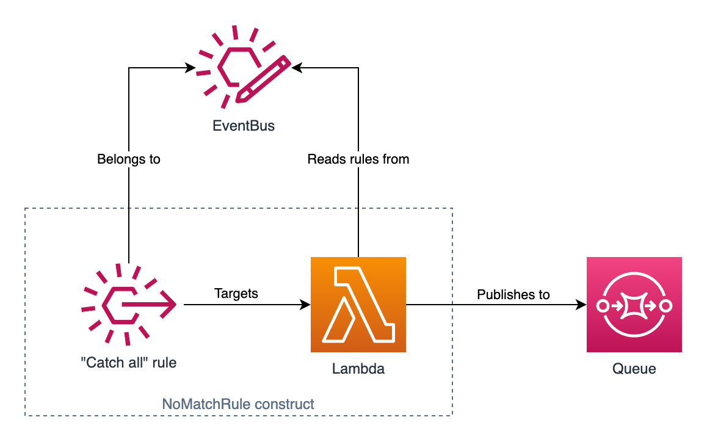

# EventBridge No Match Rule

AWS EventBridge does not natively provide a way to catch events which do not match any rules defined on an event bus. This AWS CDK project defines a custom construct, `NoMatchRule`, which captures unmatched events and forwards them to an SQS queue of your choosing.

This works by creating a rule which matches on **all** events and forwards the event to a Lambda function. The Lambda function fetches all rules from the event bus and tests the event against each rule's pattern. If no rules match the event is then sent to the SQS queue.

Note you must instantiate `NoMatchRule` at most **once** for a given event bus.

## Commands

- `npm run build` compile typescript to js
- `npm run watch` watch for changes and compile
- `npm run test` perform the jest unit tests
- `cdk deploy` deploy this stack to your default AWS account/region
- `cdk diff` compare deployed stack with current state
- `cdk synth` emits the synthesized CloudFormation template
